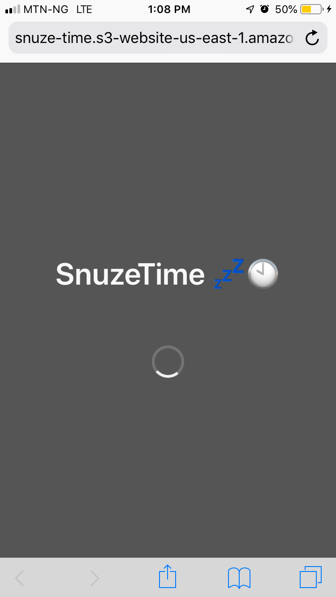
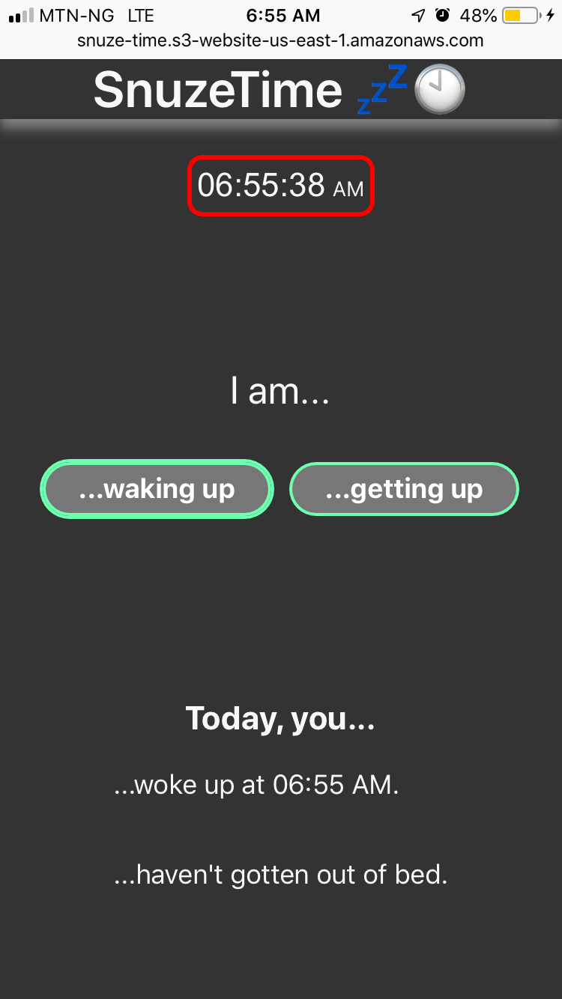
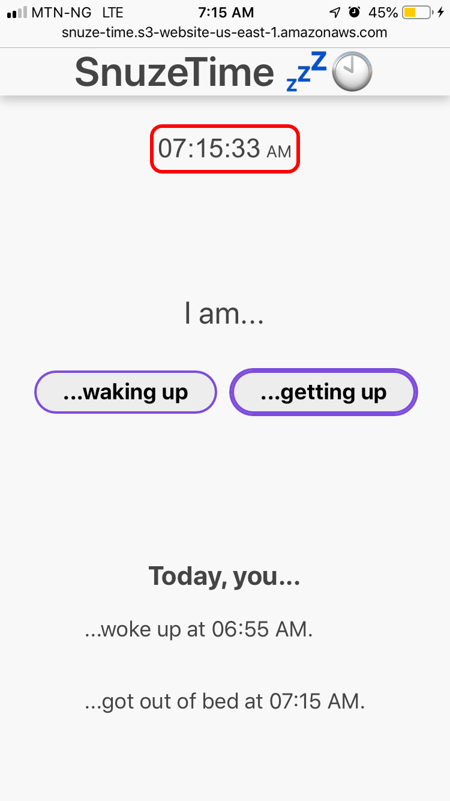

# SnuzeTime 💤🕙

A web app for recording the elapsed time between waking up and
getting out of bed (aka the 'snuzetime').

|                          Splash Screen                          |                  Waking Up<br>(dark background)                   |                  Getting Up<br>(light background)                  |
| :-------------------------------------------------------------: | :---------------------------------------------------------------: | :----------------------------------------------------------------: |
|  |  |  |

## Live Demo

- Click [here](http://snuze-time.s3-website-us-east-1.amazonaws.com/)
- Or copy and paste this URL into your browser:
  http://snuze-time.s3-website-us-east-1.amazonaws.com/

## Usage

Click/tap either the 'waking up' or 'getting out of bed' button to
record the time and see the updated record below the buttons. The app automatically adjusts between light and dark backgrounds based on
the time of day.

## Upcoming features 🔜

- View records and snuzetimes for all days between two dates
- View snuzetimes along with exact wake and get-up times
- Offline capability
- User accounts to maintain your records across devices

## Developer Set Up

First, copy the app's files to your local environment by opening
your terminal program and running:

```
git clone https://github.com/CodeWithOz/SnuzeTime.git
```

Alternatively, you can download the zip files and unzip them
into your chosen destination folder. If you are new to git, check out
[this cool tutorial](https://www.atlassian.com/git/tutorials/learn-git-with-bitbucket-cloud).

Next, the dependencies need to be installed. Run

```
npm install
```

After installing the dependencies, start the local server by running

```
npm start
```

Visit `localhost:3000` in your browser to view and use the web app.
That's it! 😄

This project was bootstrapped with
[Create React App](https://github.com/facebook/create-react-app), so
you can also use its associated scripting options.

#### Note

I added a custom `deploy` script that deploys a production build
of the app to the AWS S3 bucket where the site is hosted. Only use
this script if you have set up your own AWS S3 bucket to which
your production build will be deployed.

## Contributing

I will be happy to accept improvements to this project. Here are
some changes I plan on making so feel free to beat me to the punch 😉:

- Add service workers for offline capability
- Replace localStorage with CouchDB-PouchDB for better integration
  with service workers
- Build an account system, preferably through a third-party like Google, so users can sign up and save their data for viewing
  across multiple signed-in devices
- Add ability to manually change saved records
- Add ability to view snuzetimes of all days between two dates

Thank you in advance for your efforts! 🙌👏
